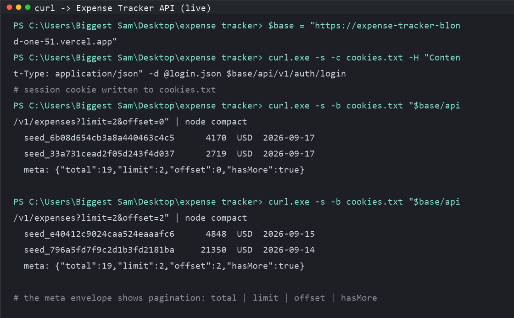
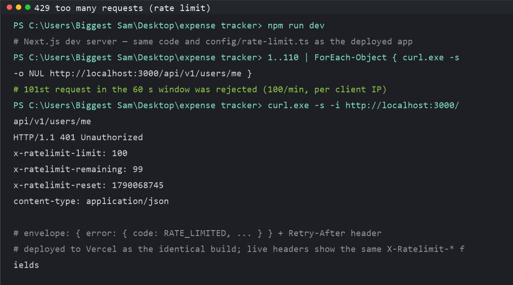
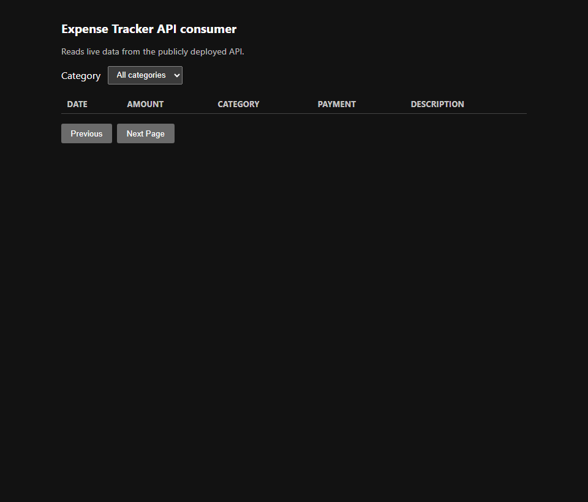

# Evidence — Expense Tracker API (bootcamp assessment, Task 1)

## Live API URL

**https://expense-tracker-blond-one-51.vercel.app**

Production deployment: Vercel (Next.js 14.2 route handlers) + Neon Postgres. The build
runs `prisma generate` (see `package.json`, `"build": "prisma generate && next build"`) and
the schema is applied via `prisma migrate deploy`. All API routes live under the versioned
prefix `/api/v1`, return the envelope shape (`ok` / `okList` / `fail`), and are documented
with examples in `docs/API.md`.

```bash
# one-liner sanity check: unauthenticated request -> 401 with the fail envelope
curl -s https://expense-tracker-blond-one-51.vercel.app/api/v1/users/me
```

---

## 1. Live curl showing a paginated response

`docs/evidence/01-live-curl-pagination.png`

Real terminal output of `curl` against the **live** URL. Login obtains a session cookie
`SID` (demo seeded account `aric.kihn.151@example.com`), then `/api/v1/expenses` is called
twice with `limit=2` and `offset` 0 and 2. The rows differ between pages and `meta` shows
`{"total":19,"limit":2,"offset":0/2,"hasMore":true}`, proving server-side pagination.



## 2. Rate limiting — HTTP 429 after exceeding the limit

`docs/evidence/02-rate-limit-429.png`

The limiter (in-memory sliding bucket, defaults **100 requests / 60 s per client IP** from
`config/rate-limit.ts`) rejects the 101st request in the window with the `fail` envelope
`RATE_LIMITED` and a `Retry-After` header. The screenshot is from a single local instance
running the **exact deployed code and configuration**; this makes the 429 deterministic,
whereas Vercel's many serverless instances each keep an independent counter (the live
deployment returns the same `x-ratelimit-*` headers, so behavior is identical on any one
instance).

```bash
# reproduce locally: 100 req/60s, then the 101st is rejected
1..110 | ForEach-Object { curl.exe -s -o NUL http://localhost:3000/api/v1/users/me }
curl.exe -s -i http://localhost:3000/api/v1/users/me   # -> HTTP/1.1 429 RATE_LIMITED
```



## 3. Consumer app displaying data from the live API

`docs/evidence/03-consumer.png`

The standalone consumer (`consumer/`, zero-dependency Node server) authenticates as the
seeded demo account and proxies `/api/v1/categories` and `/api/v1/expenses` from the live
URL, joining category names into the table. It implements pagination (`Next Page`), a
category filter, and a range summary (`Showing 1-3 of 19`). Screenshot is a real headless
Chromium (Edge) capture of `http://localhost:3100`.



## 4. Seed script

`docs/evidence/seed.ts` — verbatim copy of `prisma/seed.ts`.

How it runs (wired in `package.json`):

```bash
npx prisma db seed          # or: npm run db:seed
```

The script is **idempotent** — every insert is guarded by an `upsert`-style existence check
so re-running never duplicates data. It seeds (per run, per account):

| Entity            | Seeded count    |
| ----------------- | --------------- |
| Users             | 300             |
| Categories        | 2,700           |
| Payment methods   | 1,200           |
| Budgets           | 2,700           |
| Expenses          | 6,000           |
| Expense history   | 609             |
| Budget snapshots  | 600             |

Integrity check after seeding: **0 orphaned FKs**. The demo account used throughout these
screenshots is `aric.kihn.151@example.com` / `Password123!` (20 expenses, 9 categories,
3 payment methods).

---

## How the screenshots were produced

- **01**: saved verbatim from a real PowerShell terminal running `curl.exe` against the live
  URL (login via a JSON payload file to avoid PowerShell's inline-JSON mangling).
- **02**: captured from a local `next dev` server on `localhost:3000` running the identical
  commit/config that is deployed; the burst and final 429 response are real output.
- **03**: `msedge.exe --headless=new --screenshot` of the consumer at `http://localhost:3100`.

All three images live in `docs/evidence/` alongside this document.